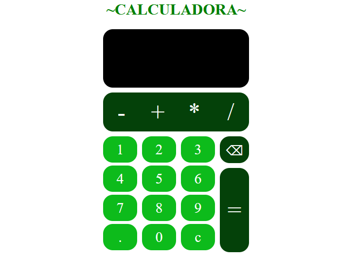

<h1 align="center">
    <a href="https://pt-br.reactjs.org/">Calculadora ReactJS</a>
</h1>
<p align="center">Calculadora desenvolvida em ReactJS para realizar seu cálculos! 📐</p>

<p align="center">
 <a href="#Features">Features</a> • 
 <a href="#Rodando">Rodando a aplicação</a> • 
 <a href="#Tecnologias">Tecnologias</a>
</p>

<h4 align="center"> 
	✔️Calculadora Reactjs pronta para uso!!✔️
</h4>

### Features

- [x] Adição
- [x] Subtração
- [x] Divição
- [x] Multiplicação

<div align="center">
	
</div>
### Pré-requisitos

Para poder utilizar a calculadora, você vai precisar ter instalado em sua máquina as seguintes ferramentas:
[Git](https://git-scm.com), [Node.js](https://nodejs.org/en/). 

### Rodando a aplicação

```bash
# Clone este repositório
$ git clone <https://github.com/JoaoVitorSoares10/Calculadora.git>

# Acesse a pasta do projeto no terminal/cmd
$ cd calculadora

# Instale as dependências
$ npm install

# Execute a aplicação react
$ npm start

# A aplicação inciará na porta:3000 - acesse <http://localhost:3000>
```

### Tecnologias

As seguintes ferramentas foram usadas na construção do projeto:

- [React](https://pt-br.reactjs.org/)

Feito com ❤️ por João Vitor Soares 👋🏽 Entre em contato!
